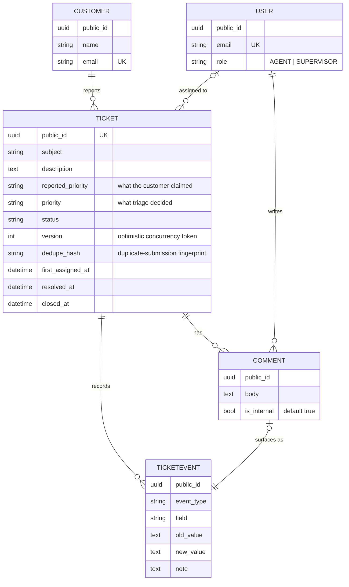
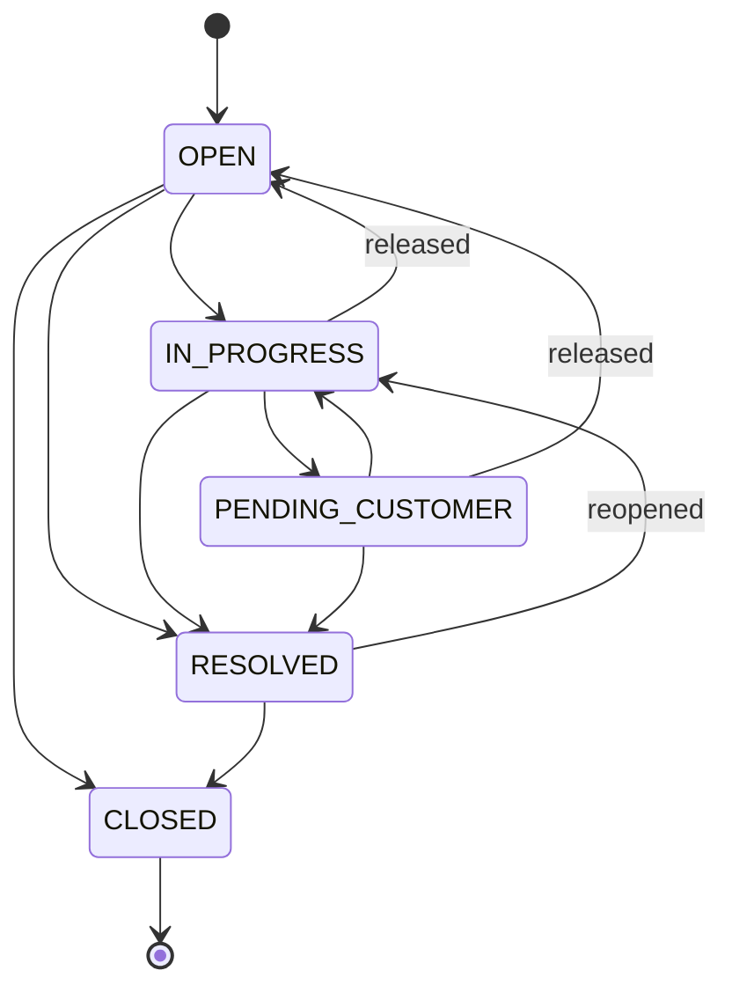

# Support Request Management System

REST API for the internal agents of a support desk: customers open requests, agents
triage, assign, comment and resolve them, and **nothing changes without leaving a
trace**.

Python 3.12 · Django 5.2 · Django REST Framework · PostgreSQL 16 · Docker

---

## 1. Run it

```bash
docker compose up --build
```

That is the whole setup. The container waits for Postgres, applies the migrations,
loads a demo dataset and serves the API on <http://localhost:8000>.

| What | Where |
|---|---|
| API index | <http://localhost:8000/api/v1/> — every entry point, no token needed |
| Swagger UI | <http://localhost:8000/api/docs/> — 19 operations over 16 routes |
| ReDoc | <http://localhost:8000/api/redoc/> |
| OpenAPI schema | <http://localhost:8000/api/schema/> · committed at [`docs/openapi.yaml`](docs/openapi.yaml) |
| Read-only admin | <http://localhost:8000/admin/> |
| Health check | <http://localhost:8000/api/v1/health/> |

**Demo accounts** (created by `manage.py seed_demo`, password `demo12345`):

| Email | Role |
|---|---|
| `supervisor@support.local` | SUPERVISOR |
| `ana.reyes@support.local` | AGENT |
| `luis.ferrer@support.local` | AGENT |

The seed builds ~25 tickets spread across every status, each with a real history —
because it replays them through the same service layer the API uses.

```bash
# log in
curl -s localhost:8000/api/v1/auth/token/ \
  -H 'Content-Type: application/json' \
  -d '{"email":"ana.reyes@support.local","password":"demo12345"}'

# open a ticket as a customer — no authentication
curl -s localhost:8000/api/v1/public/tickets/ \
  -H 'Content-Type: application/json' \
  -d '{"customer":{"name":"Elena Duarte","email":"elena@northwind.example"},
       "subject":"Cannot log in after the password reset",
       "description":"The reset link says it has expired and I have tried three times.",
       "reported_priority":"HIGH"}'
```

Two ways to exercise the whole thing at once:

```bash
./scripts/smoke-test.sh   # or: make smoke
```

It walks public intake, idempotency, login, an illegal transition, a version
conflict, the timeline, what a customer may see, permissions and the refused
delete — asserting the status code of each and failing loudly on the first
surprise.

For a request-by-request tour, [`docs/requests.http`](docs/requests.http) runs in
VS Code (REST Client) or JetBrains. Postman users can import
[`docs/postman_collection.json`](docs/postman_collection.json): 40 requests in 7
folders that chain their own variables, with 77 assertions, so the Collection
Runner is the same end-to-end check in a UI (verified green with Newman). Both endpoints the collection leans
on are rate limited on purpose, so run it at most twice a minute — or
`docker compose restart web` to reset the counters.

Other useful commands (all wrapped in the [`Makefile`](Makefile)):

```bash
make test       # pytest + coverage
make lint       # ruff + black --check
make typecheck  # mypy
make seed       # reload the demo dataset
make reset      # stop everything and drop the database volume
```

---

## 2. The domain



### State machine



The table lives in [`apps/tickets/enums.py`](apps/tickets/enums.py) as a dictionary,
and the ticket detail response publishes `allowed_transitions` so the client renders
the real machine instead of a copy of it.

Invariants:

- Entering `IN_PROGRESS` requires an assignee. If the caller does not name one, they
  become it, and both events are recorded.
- `RESOLVED` stamps `resolved_at`; reopening clears it.
- `CLOSED` is terminal. A write against it answers **409**, not 400 — the request is
  not malformed, the resource simply no longer accepts writes.
- Releasing a ticket somebody was on the hook for — `IN_PROGRESS` or
  `PENDING_CUSTOMER` — returns it to `OPEN`. When the customer finally replies,
  that reply has to land on somebody.
- An illegal transition answers **400** and names the legal destinations.

---

## 3. Endpoints

Base path: `/api/v1/`. Every resource is addressed by its public UUID.

### Public — no authentication

| Method | Path | Notes |
|---|---|---|
| POST | `/public/tickets/` | Throttled per IP **and** per reported email. Idempotent: `201` on create, `200` when a duplicate is replayed. JSON only. |
| GET | `/public/tickets/{uuid}/` | Subject, status and dates. Nothing else. |

### Authentication

| Method | Path |
|---|---|
| POST | `/auth/token/` — access + refresh, plus the user object |
| POST | `/auth/token/refresh/` |
| GET | `/me/` |

### Agents — authenticated

| Method | Path | Notes |
|---|---|---|
| GET | `/api/v1/` | Index of every entry point, unauthenticated |
| GET | `/tickets/` | Filters, search, ordering, pagination |
| POST | `/tickets/` | Intake on behalf of a customer; accepts `Idempotency-Key` |
| GET | `/tickets/{uuid}/` | Includes `version` and `allowed_transitions`; sends an `ETag` |
| PATCH | `/tickets/{uuid}/` | `subject` and `description` only |
| POST | `/tickets/{uuid}/status/` | `{status, note}` |
| POST | `/tickets/{uuid}/priority/` | `{priority, note}` |
| POST | `/tickets/{uuid}/assign/` | `{assignee_id \| null, note}` |
| POST | `/tickets/{uuid}/assign-to-me/` | Shortcut for the common case |
| GET · POST | `/tickets/{uuid}/comments/` | Cursor-paginated. Comments are internal; see the scope note below |
| GET | `/tickets/{uuid}/timeline/` | Events and comments in one feed |
| GET | `/agents/` | Directory for the assignment picker; returns the whole desk, unpaginated in practice |
| GET | `/health/` | Liveness + database |

Every write endpoint accepts an optional `If-Match: <version>` header.

### Filtering

```
GET /api/v1/tickets/?status=OPEN&status=IN_PROGRESS&priority=HIGH
    &assignee=<uuid>&unassigned=true&customer_email=elena@northwind.example
    &created_after=2026-01-01T00:00:00Z&search=login&ordering=-priority
```

`ordering=-priority` sorts URGENT → LOW and `ordering=status` walks the workflow
(OPEN → CLOSED), rather than sorting the stored strings alphabetically.
`ordering=-last_activity_at` is the "what moved recently" sort: comments count as
activity, which `updated_at` would not have reflected, so `updated_at` is
deliberately not offered as an ordering field.

### Error contract

Every failure — validation, permission, domain rule, crash — has one shape:

```json
{
  "error": {
    "code": "invalid_transition",
    "message": "Cannot move a ticket from OPEN to PENDING_CUSTOMER.",
    "details": { "current": "OPEN", "requested": "PENDING_CUSTOMER",
                 "allowed": ["CLOSED", "IN_PROGRESS", "RESOLVED"] },
    "request_id": "9f1c2b7e4a5d4c0e9d3a"
  }
}
```

| Code | HTTP | When |
|---|---|---|
| `validation_error` | 400 | Payload rejected; `details.fields` names each one |
| `malformed_request` | 400 | The body never parsed as JSON, so there are no fields to report |
| `invalid_transition` | 400 | Illegal status change; `details.allowed` lists the legal ones |
| `not_authenticated` | 401 | Missing or bad credentials |
| `permission_denied` | 403 | Role or ownership rule |
| `not_found` | 404 | Unknown UUID |
| `version_conflict` | 409 | Stale `If-Match` |
| `request_too_large` | 413 | Body over `DATA_UPLOAD_MAX_MEMORY_SIZE`, on every path |
| `ticket_closed` | 409 | Write against a terminal ticket |
| `throttled` | 429 | Public intake rate limit |
| `server_error` | 500 | Unhandled — logged with the same `request_id` |

`request_id` is echoed in the `X-Request-ID` response header and stamped on every log
line, so a user's report maps to a server log without guesswork.

---

## 4. Architecture decisions

Each of these is a choice that could have gone the other way. The cost column is the
part that is usually left out.

### ADR-01 · Business logic in a service layer, not in signals

**Decision.** All writes go through [`apps/tickets/services.py`](apps/tickets/services.py).
Views authenticate, parse and delegate.
**Why.** Signals make the audit trail implicit: the ordering is invisible, the control
flow is hard to follow and testing means firing a save to see what happens. An explicit
service reads top to bottom and is transactional by construction.
**Cost.** A little boilerplate in the views. It buys one file where the rules live.

### ADR-02 · Custom user model from the first migration

**Decision.** `AbstractUser` with a `role` field (`AGENT` / `SUPERVISOR`), and email as
the login field.
**Why.** Swapping the user model after the initial migration is effectively a schema
rewrite. Ten minutes now or a weekend later.
**Cost.** Ten minutes now.

### ADR-03 · Customers are not users of the system

**Decision.** `Customer` is its own model (name + email). Customers never authenticate.
**Why.** They are external parties. Giving them accounts means passwords, resets,
sessions and a whole second authorisation surface, none of which is what this system is
for.
**Cost.** No customer portal — declared out of scope, not forgotten. The public
endpoints cover intake and tracking.

### ADR-04 · A public UUID is the identifier everywhere

**Decision.** The sequential `id` is internal and never leaves the process. Every
endpoint, public and private, looks up by `public_id`.
**Why.** A sequential id in a URL publishes the business's volume and invites
enumeration. Using UUIDs only on the public side and integers internally is an
inconsistency a reviewer spots immediately — and the first leak comes from the endpoint
nobody remembered was public.
**Cost.** Longer URLs and a slightly larger index. Irrelevant at this scale.

### ADR-05 · A semantic event table, not `django-simple-history`

**Decision.** A `TicketEvent` model with domain event types.
**Why.** The library mirrors every row and answers "what changed". An agent reading a
ticket needs "what happened": *Marta assigned this to Ana, who moved it to in progress
and asked for logs*. Those are different questions.
**Cost.** The events are written by hand — but always inside the service, so there is
exactly one place where that can be forgotten, and it is covered by tests.

### ADR-06 · Pessimistic locking on every mutation

**Decision.** `select_for_update()` inside `transaction.atomic()`.
**Why.** Two agents acting at the same moment can each perform a valid transition that
is invalid as a pair, and leave a history that contradicts itself.
**Cost.** A row lock held for milliseconds.

### ADR-07 · Optimistic concurrency exposed to the client

**Decision.** Tickets carry a `version` integer, published as an `ETag`. Write endpoints
accept `If-Match`; a stale value gets `409 version_conflict` with both versions in
`details`.
**Why.** The lock protects the database; it does nothing about the agent who opened a
form ten minutes ago and is about to overwrite a colleague's work. The header is
optional, so a simple client keeps working and a careful one is protected.
**Cost.** One field and one guard clause.

### ADR-08 · One unified timeline, built on the events table

**Decision.** `GET /tickets/{uuid}/timeline/` returns events and comments merged
chronologically with a `kind` discriminator. Adding a comment also writes a
`COMMENT_ADDED` event that points at it.
**Why.** An agent wants one story, not two tabs to interleave mentally. Modelling the
comment *as* an event means the feed is a single ordered queryset — which is what makes
correct cursor pagination possible at all. Merging two lists in Python cannot be
cursor-paginated without lying about the boundaries.
**Cost.** One nullable foreign key.

### ADR-09 · The customer's priority is a claim, not a fact

**Decision.** The public field is `reported_priority` and it seeds `priority`, which the
agent may reclassify. The reported value is never overwritten.
**Why.** If the customer sets priority bindingly, everything is `URGENT` within a week.
Triage is the agent's job. Keeping both makes "customers overstate urgency" a measurable
fact instead of an anecdote.
**Cost.** One extra column.

### ADR-10 · Agents can open tickets for customers

**Decision.** `POST /tickets/` exists alongside the public endpoint, and records
`created_by`.
**Why.** The most common real intake is a phone call. A system where only the customer
can open a ticket does not survive contact with a support desk.
**Cost.** A second input serializer. The creation service is shared, so both paths
produce the same record and the same event.

### ADR-11 · `PENDING_CUSTOMER` means waiting outside the system

**Decision.** The status stays, documented as "waiting on the customer by email or
phone". Only an agent moves a ticket out of it.
**Why.** Without a customer portal the status could look useless. It is not: it takes
the ticket out of the agent's active queue and marks the wait as the customer's, which
is exactly what an SLA clock needs to know. What is missing is the external trigger, and
that is out of scope.
**Cost.** It needs this paragraph. Without it, it reads as an oversight.

### ADR-12 · Comments are immutable

**Decision.** No `PATCH`, no `DELETE` — and the model itself refuses to be updated or
deleted.
**Why.** Comments are part of the record of an incident. A comment that can be edited
invalidates the entire history around it. Enforcing it only by "we did not add the
route" means the next developer to add one silently removes the guarantee.
**Cost.** A mistaken comment is corrected by another comment. That is the right answer
anyway.

### ADR-13 · Tickets are never deleted

**Decision.** There is no `DELETE /tickets/{uuid}/`. `CLOSED` is terminal.
**Why.** Deleting destroys the traceability of something a customer reported. If it were
ever needed it would be a soft delete, with a reason and an actor.
**Cost.** None.

### ADR-14 · Releasing an in-progress ticket returns it to the queue

**Decision.** Unassigning an `IN_PROGRESS` ticket moves it to `OPEN` and records both
`UNASSIGNED` and `STATUS_CHANGED`.
**Why.** `IN_PROGRESS` with nobody responsible is a status that lies: nobody is working
on it and it shows up in no queue. It is the classic way a ticket disappears.
**Cost.** A side effect — but an explicit, audited one.

### ADR-15 · Idempotent public intake

**Decision.** The public endpoint accepts an optional `Idempotency-Key` (honoured for
24h). Without one, a byte-identical submission from the same address within 60 seconds
returns `200` with the original ticket instead of creating a second.
**Why.** Double clicks and network retries are the leading cause of duplicate tickets in
real systems, and duplicates cost an agent's time, not a row of storage.
**Cost.** One indexed column and one query before the insert. Two *simultaneous*
identical requests can still both miss the check; closing that would need a uniqueness
constraint that would also block a legitimate resubmission a month later, which is a bad
trade for the frequency involved.

### ADR-16 · Explicit actions instead of a generic `PATCH`

**Decision.** `POST .../status/`, `.../priority/`, `.../assign/`. `PATCH` is left for
descriptive fields.
**Why.** A generic `PATCH` forces the server to infer intent by diffing values, and has
nowhere to put the `note` that explains *why* the change was made — which is the most
valuable column in the audit table.
**Cost.** Less "pure REST". Deliberate: the resource is a workflow, and its verbs are
transitions.

### ADR-17 · One serializer per use case

**Decision.** `TicketListSerializer`, `TicketDetailSerializer`, `TicketPublicSerializer`,
and separate input serializers.
**Why.** A single serializer ends up full of conditional `SerializerMethodField`s, and
the day somebody adds a field it appears in every representation at once — including the
unauthenticated one.
**Cost.** More classes, each one trivial. A test asserts the exact field set of the
public response.

### ADR-18 · UTC everywhere, ISO 8601 at the edge

**Decision.** `USE_TZ = True`, UTC in the database, ISO 8601 with offset on the wire.
Localisation is the client's job.
**Why.** Naive datetimes are the most expensive and most silent bug a ticketing system
can have: everything looks right until a DST boundary or a second timezone appears.
**Cost.** None, if decided on day one.

### Deviations from the original plan

Two, both deliberate:

- **`DETAILS_UPDATED` was added to the event types.** The plan's list had no event for
  editing `subject`/`description`, but the Definition of Done requires that no change go
  unrecorded. The rule won.
- **`old_value`/`new_value` are `TextField`, not `CharField(64)`.** A description edit
  has to fit in the snapshot or the audit trail is lossy. In Postgres the storage is
  identical.

One rule worth flagging because it is debatable: a `CLOSED` ticket rejects **every**
write, including new comments. That follows the plan's "closed is terminal" literally.
The alternative — allowing comments on closed tickets — is defensible; if that is what
the desk wants, the change is one guard clause in `add_comment`, and reopening
(`RESOLVED → IN_PROGRESS`) already exists for anything more substantial.

---

## 5. Permissions

| Action | AGENT | SUPERVISOR |
|---|---|---|
| View tickets | All | All |
| Create on behalf of a customer | Yes | Yes |
| Change status | If assignee, or the ticket is unclaimed | Always |
| Edit subject/description | If assignee, or the ticket is unclaimed | Always |
| Take an unclaimed ticket | Yes | Yes |
| Release their own ticket | Yes | Yes |
| Assign to another agent | No | Yes |
| Change priority | Yes | Yes |
| Comment | Yes | Yes |

The whole model is one table of rules in
[`apps/tickets/permissions.py`](apps/tickets/permissions.py) — data, not `if` statements
spread across views, so it can be read at a glance and tested exhaustively.

---

## 6. Tests

```bash
make test           # or: docker compose run --rm web test --cov
```

**187 tests, 100% coverage** of `apps/` and `config/`. `mypy apps config` is clean and runs in CI.

What is actually asserted, in order of value:

1. **The full transition matrix** — every state to every state, 25 combinations, driven
   from the same table the code enforces.
2. **Every mutation writes exactly one event**, with the right `old_value`/`new_value`,
   and history survives an agent being renamed.
3. **Version conflicts** — two writes with the same `If-Match` and the second gets 409.
4. **Writes against a closed ticket** — 409 on every endpoint.
5. **Releasing an `IN_PROGRESS` ticket** leaves it `OPEN` with two events.
6. **Permissions** — an agent cannot touch a colleague's ticket or reassign one.
7. **The public endpoint leaks nothing** — the exact field set is asserted, and internal
   comments, agent identity and history are checked to be absent from the raw body.
8. **Double submits** — two identical posts return the same `public_id`.
9. **Throttling** of public intake.
10. **No N+1** — query counts must not grow with the number of rows.
11. **Database constraints** — raw `UPDATE`s that would create an inconsistent row are
    rejected by Postgres, not by the application.
12. **Comments and events cannot be rewritten**, at the model level.
13. **The JWT never carries the internal id** — the token subject is the public UUID.
14. **The login endpoint is throttled**, and the read-only admin really is read-only.
15. **`OPTIONS` describes an endpoint** instead of refusing it, and a body that is not
    JSON gets its own error code rather than borrowing the validation one.
16. **The open endpoint holds up under abuse** — a public submission cannot rename a
    customer, `X-Forwarded-For` cannot buy a fresh rate-limit bucket, one email is
    limited across many addresses, oversized bodies answer `413` in the same envelope,
    and only JSON is accepted.

What is not tested: that Django saves to the database.

---

## 7. Operations

- **`request_id` per request** (`X-Request-ID`), in every log line and every error body.
- **Structured JSON logging**, level configurable per environment.
- **`/api/v1/health/`** opens a real database connection rather than reporting that the
  process is running.
- **The login endpoint is rate limited** (`auth_token`, 10/min by default): an
  unauthenticated endpoint that checks passwords is the cheapest thing here to attack.
- **`NUM_PROXIES` defaults to 0, and that matters.** DRF's own default trusts
  `X-Forwarded-For` whenever it is present, which lets anyone invent a value and get
  a fresh rate-limit bucket on every request. Pinning it to 0 identifies clients by
  `REMOTE_ADDR`. **A deployment behind N proxies must set it to N**, or every client
  shares the load balancer's single bucket.
- **The open endpoint is limited twice**: per IP (20/hour) and per reported email
  (5/hour). The edge sees addresses, not customers, so the second dimension is the
  one infrastructure cannot provide.
- **An open endpoint cannot rewrite an identity.** A public submission never updates
  an existing customer's name; the name it carries is stored on the ticket as
  `reported_by_name`, where a mismatch is a signal instead of a silent overwrite.
- **Text fields are bounded** (20,000 characters) and the request body is capped at
  1 MB, because no endpoint accepts uploads.
- **Production refuses to boot on a per-process cache.** Throttle counters live
  there, so a local cache silently multiplies every limit by the number of workers.
- **Query strings stay out of the logs.** `?customer_email=` and `?search=` carry
  personal data, and an access log is the wrong place to keep it.
- **No secrets in the repository** — `django-environ` plus a complete `.env.example`.
- **Settings per environment** (`base` / `local` / `test` / `production`). Production has
  no default `SECRET_KEY` or `ALLOWED_HOSTS`: if they are missing the process must refuse
  to boot, not boot insecurely.
- **The Django admin is read-only.** Editing a ticket there would bypass the service
  layer, and therefore the state machine, the version counter and the audit trail.
- **CI** ([`.github/workflows/ci.yml`](.github/workflows/ci.yml)): ruff, black, mypy, a
  check for missing migrations, the test suite with coverage, and a diff that fails if
  the committed OpenAPI schema is out of date.

---

### Two decisions worth stating plainly

**An agent cannot change the status of a colleague's ticket.** The brief says
agents must be able to change the status of a request; here an `AGENT` may do so
on tickets they own or that nobody has claimed, and a `SUPERVISOR` may do so on
anything. That is a deliberate narrowing: reaching into work somebody else is
doing is how two agents end up contradicting each other on the same incident.
The cost is real and worth naming — if the assigned agent is off sick and no
supervisor is on shift, that ticket waits. If the desk wants the looser rule, it
is one entry in `ACCESS_MATRIX`.

**Comments are internal, and the API does not pretend otherwise.**
`Comment.is_internal` exists on the model for the day a customer-facing reply is
added, but it cannot be set through the API: no endpoint shows a comment to a
customer, so accepting `is_internal: false` would let an agent believe they had
written to somebody who will never read it.

## 8. Out of scope

Declared, not overlooked: attachments · email notifications · Celery and background
work · WebSockets · SLA clocks with automatic pause and escalation · an authenticated
customer portal · multi-tenancy · full-text search with `tsvector` · metrics dashboards ·
soft delete with a reason · a React front end.

### With more time, in this order

1. A small React client — the two details that would matter are building the status
   selector from `allowed_transitions` and sending `If-Match`, so the UI never duplicates
   the state machine and never silently overwrites a colleague.
2. SLA timers that pause in `PENDING_CUSTOMER`, which is the reason that status exists.
3. Email notifications on assignment and resolution, through a queue — the first thing
   that genuinely needs Celery.
4. A `reopened_count` and resolution-time metrics, now that the event table makes both
   computable without new instrumentation.
